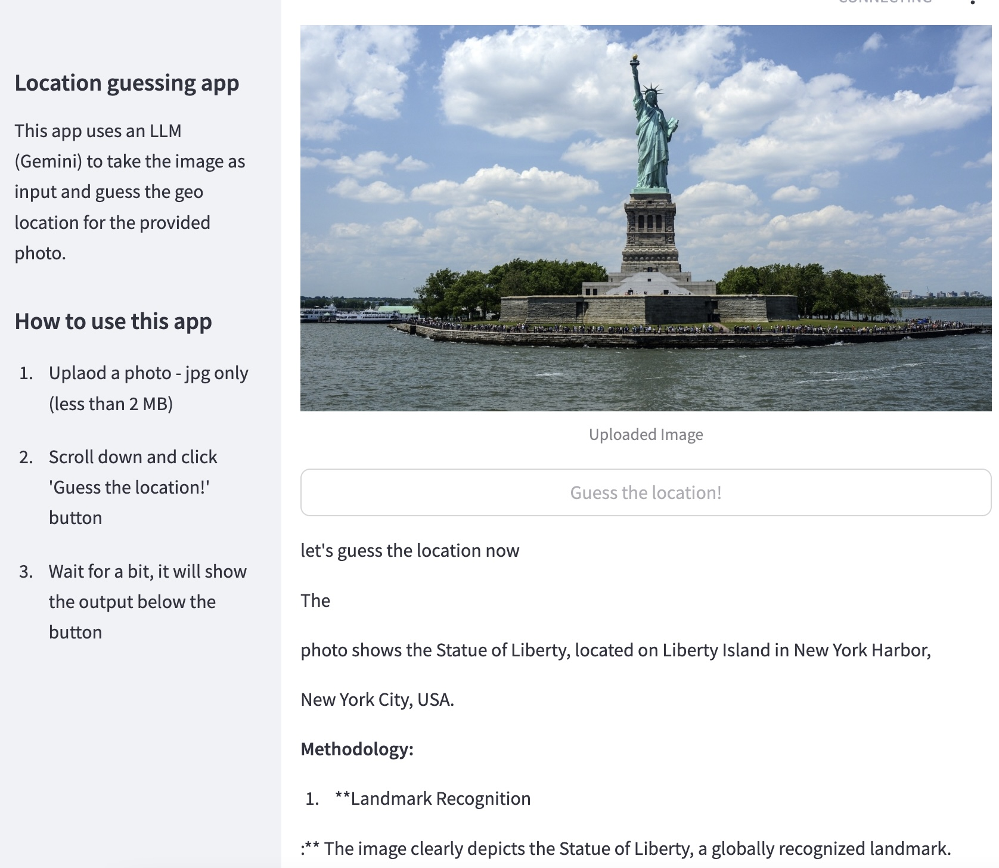

# image-to-geo-location-llm

A demo project to get the location or geo location from an image using a LLM with a Streamlit UI

## How to run

To run the app execute `python -m streamlit run streamlit_app.py` it will open the browser.

## Output

This is how it looks when it runs:



## Deploy on Cloud Run

[](https://deploy.cloud.run)

### If button goes to Cloud Shell Quota issue

Run the following on your Google Cloud Shell

```bash
cloudshell_open --repo_url "https://github.com/geshan/image-to-geo-location-llm.git" --git_branch "master" --page "shell" --force_new_clone
```
